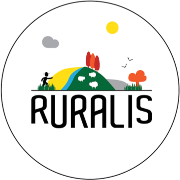

# RURALIS®

Ruralis, un jeu pédagogique sur les infrastructures agro-écologiques

Ruralis est un jeu de société, qui permet de réfléchir sur l’implantation d'IAE dans une exploitation agricole, et d'en appréhender les différents enjeux.
## Environment variable
REACT_APP_API_HOST : link to the server

## Travis 

## Setup
You need Node.js (version >= 10) & npm. Once installed simply run `npm install` followed by `npm run dev` and you should be running.

## Style
This project use [standard](https://standardjs.com/). Standard help to improve code readability by standardizing code style. To run standard type `npm run style`. To let standard auto fix the errors type `npm run style-fix`.

## Build
Run `npm run-script build`.

Builds the app for production to the `build` folder. 
It correctly bundles React in production mode and optimizes the build for the best performance.

The build is minified and the filenames include the hashes. 
Your app is ready to be deployed!
